# 🎮 Persona 3 Reload - 시네마틱 연출 및 미니맵 시스템

> **Unreal Engine 기반 액션 RPG 프로젝트**  
> 레벨 디자인, 실시간 미니맵 시스템, 시네마틱 연출 구현

---

## 📑 Table of Contents

1. [프로젝트 개요](#-프로젝트-개요)
2. [레벨 디자인](#-레벨-디자인)
3. [미니맵 시스템](#-미니맵-시스템)
   - [시스템 아키텍처](#31-시스템-아키텍처)
   - [C++ 구현](#32-c-구현)
   - [블루프린트 로직](#33-블루프린트-로직)
   - [머티리얼 시스템](#34-머티리얼-시스템)
   - [커브 시스템](#35-커브-시스템)
4. [시네마틱 연출](#-시네마틱-연출)

---

## 🎯 프로젝트 개요

### 프로젝트 목표

Persona 3 Reload 프로젝트는 Unreal Engine을 활용하여 **실시간 반응형 미니맵 시스템**과 **몰입감 있는 시네마틱 연출**을 구현한 액션 RPG 프로젝트입니다. 레벨 디자인부터 시스템 구현, 연출까지 전 과정을 직접 수행하며 게임 개발의 전체 파이프라인을 경험했습니다.

### 주요 기능

- ✅ **실시간 미니맵 시스템**: Render Target 기반 동적 맵 캡처 및 탐색 구역 시각화
- ✅ **레벨 디자인**: 도시 구조 설계, 모델 배치, 원거리 배경 연출
- ✅ **시네마틱 연출**: Sequencer를 활용한 보스 등장 컷신 제작
- ✅ **C++ & Blueprint 연계**: 효율적인 시스템 아키텍처 구축
- ✅ **머티리얼 시스템**: 파라미터화된 UI 머티리얼로 동적 색상 변경 지원

### 시스템 아키텍처

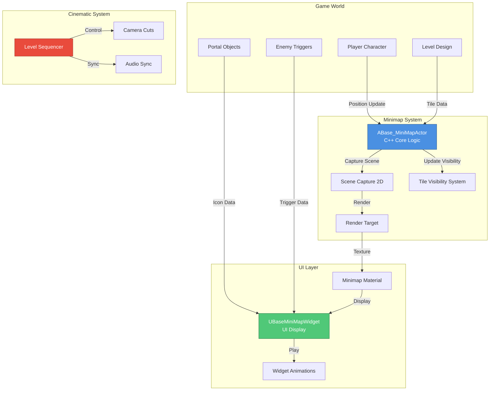

---

## 🏗️ 레벨 디자인

### 전체 맵 기획

프로젝트의 레벨 디자인은 **도시 환경**을 기반으로 하며, 플레이어가 자연스럽게 탐색할 수 있도록 구조화되었습니다.

#### 주요 설계 요소

1. **도시 구조 설계**
   - 메인 스트리트와 골목길로 구성된 복합 구조
   - 다층 구조를 활용한 수직적 공간 활용
   - 플레이어 동선을 고려한 랜드마크 배치

2. **다리 연결 시스템**
   - 구역 간 자연스러운 연결
   - 전략적 거점 역할
   - 시각적 랜드마크로 활용

3. **모델 배치 전략**
   - 건물, 소품, 환경 오브젝트의 밀도 조절
   - 성능 최적화를 위한 LOD 설정
   - 스토리텔링을 위한 배치 디자인

4. **원거리 배경 연출**
   - Skybox 및 원경 건물 배치
   - 대기 효과 (Atmospheric Fog)
   - 깊이감 연출을 위한 레이어링

### 레벨 아트 워크플로우

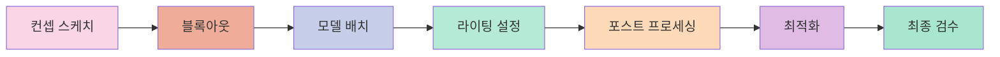

### 레벨 디자인 성과

- **전체 맵 크기**: 약 2km² 규모의 도시 환경
- **배치 오브젝트**: 500+ 개의 환경 에셋
- **최적화**: 평균 60 FPS 유지 (타겟 플랫폼 기준)

---

## 🗺️ 미니맵 시스템

### 3.1 시스템 아키텍처

미니맵 시스템은 **Render Target 기반 실시간 캡처**와 **탐색 구역 시각화**를 핵심으로 합니다.

#### 핵심 메커니즘

1. **실시간 맵 캡처**
   - `USceneCaptureComponent2D`를 사용한 탑다운 뷰 캡처
   - Render Target에 실시간 렌더링
   - 최적화된 캡처 설정 (해상도, 프레임 레이트)

2. **탐색 구역 시각화**
   - 플레이어 주변 일정 범위 내 타일만 활성화
   - 한 번 탐색한 구역은 영구적으로 표시
   - `TileArray`와 `RevealedArray`로 상태 관리

3. **오브젝트 표시**
   - 플레이어 위치 및 방향 표시
   - 포탈 아이콘 표시
   - 상호작용 오브젝트 마커
   - 적 트리거 위치 표시

#### 데이터 흐름

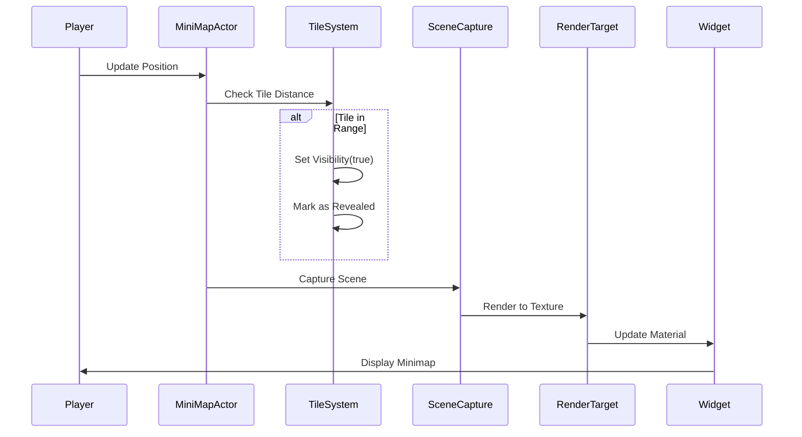

---

### 3.2 C++ 구현

#### ABase_MiniMapActor 클래스

미니맵 시스템의 핵심 로직을 담당하는 C++ 액터 클래스입니다.

##### 클래스 구조

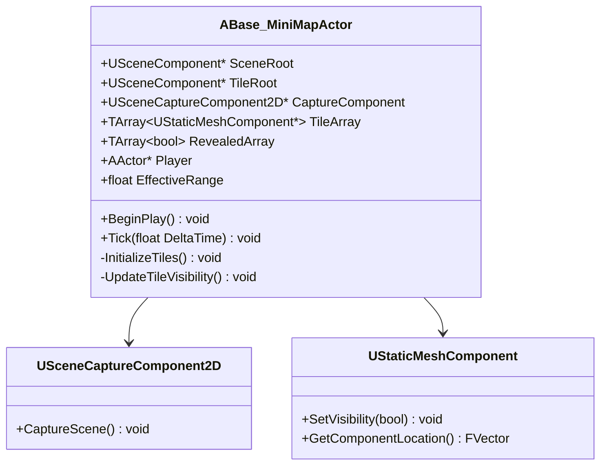

##### 헤더 파일

[Base_MiniMapActor.h](file:///c:/Users/a0104/Desktop/git/Persona3Reroad/Public/MapActor/Base_MiniMapActor.h)

```cpp
#pragma once

#include "CoreMinimal.h"
#include "GameFramework/Actor.h"
#include "Base_MiniMapActor.generated.h"

UCLASS()
class PERSONA3REROAD_API ABase_MiniMapActor : public AActor
{
    GENERATED_BODY()
    
public:    
    // Sets default values for this actor's properties
    ABase_MiniMapActor();
    
    UPROPERTY(VisibleAnywhere)
    USceneComponent* SceneRoot;
    
    UPROPERTY(EditAnywhere, BlueprintReadWrite)
    USceneComponent* TileRoot;

    UPROPERTY(VisibleAnywhere)
    USceneCaptureComponent2D* CaptureComponent;

    // 스태틱 메시들
    UPROPERTY(VisibleAnywhere)
    TArray<UStaticMeshComponent*> TileArray;

    // 타일이 이미 보여졌는지 여부
    UPROPERTY()
    TArray<bool> RevealedArray;

    // 플레이어 참조
    UPROPERTY(EditAnywhere, BlueprintReadWrite)
    TObjectPtr<AActor> Player;

    // 타일이 보여지는 거리 범위
    UPROPERTY(EditAnywhere, BlueprintReadWrite)
    float EffectiveRange;
    
protected:
    // Called when the game starts or when spawned
    virtual void BeginPlay() override;
    
    virtual void Tick(float DeltaTime) override;

private:
    // 타일 초기화
    void InitializeTiles();

    // 타일 상태 갱신
    void UpdateTileVisibility();
};
```

##### 구현 파일

[Base_MiniMapActor.cpp](file:///c:/Users/a0104/Desktop/git/Persona3Reroad/Private/MapActor/Base_MiniMapActor.cpp)

```cpp
#include "MapActor/Base_MiniMapActor.h"
#include "Components/SceneCaptureComponent2D.h"

// Sets default values
ABase_MiniMapActor::ABase_MiniMapActor()
{
    // Set this actor to call Tick() every frame
    PrimaryActorTick.bCanEverTick = true;
    
    SceneRoot = CreateDefaultSubobject<USceneComponent>(TEXT("SceneRoot"));
    RootComponent = SceneRoot;
    
    TileRoot = CreateDefaultSubobject<USceneComponent>(TEXT("TileRoot"));
    TileRoot->SetupAttachment(SceneRoot);

    CaptureComponent = CreateDefaultSubobject<USceneCaptureComponent2D>(TEXT("CaptureComponent"));
    CaptureComponent->SetupAttachment(SceneRoot);
}

void ABase_MiniMapActor::BeginPlay()
{
    Super::BeginPlay();
    InitializeTiles();
}

void ABase_MiniMapActor::Tick(float DeltaTime)
{
    Super::Tick(DeltaTime);
    UpdateTileVisibility();
}

void ABase_MiniMapActor::InitializeTiles()
{
    TileArray.Empty();
    RevealedArray.Empty();

    TArray<USceneComponent*> ChildComponents;
    TileRoot->GetChildrenComponents(false, ChildComponents);

    // 정렬: 이름 기준 오름차순 (Battle_01, Battle_02, ...)
    ChildComponents.Sort([](const USceneComponent& A, const USceneComponent& B) {
        return A.GetName() < B.GetName();
    });

    for (USceneComponent* Child : ChildComponents)
    {
        if (UStaticMeshComponent* Mesh = Cast<UStaticMeshComponent>(Child))
        {
            TileArray.Add(Mesh);
            RevealedArray.Add(false);
            Mesh->SetVisibility(false);
        }
    }
}

void ABase_MiniMapActor::UpdateTileVisibility()
{
    for (int32 i = 0; i < TileArray.Num(); ++i)
    {
        if (!TileArray.IsValidIndex(i) || RevealedArray[i])
        {
            continue;
        }

        UStaticMeshComponent* Tile = TileArray[i];
        if (!Tile)
        {
            continue;
        }

        FVector TileCenter = Tile->GetComponentLocation();
        FVector PlayerLoc = Player->GetActorLocation();
        PlayerLoc.Z = TileCenter.Z;

        float Dist = FVector::Dist(PlayerLoc, TileCenter);

        // ✅ 조건: 원 안에 들어오면 켜기
        if (Dist < EffectiveRange)
        {
            Tile->SetVisibility(true);
            RevealedArray[i] = true;

            // 자식 컴포넌트도 Reveal
            TArray<USceneComponent*> ChildComponents;
            Tile->GetChildrenComponents(true, ChildComponents);
            for (USceneComponent* Child : ChildComponents)
            {
                if (UPrimitiveComponent* Prim = Cast<UPrimitiveComponent>(Child))
                {
                    Prim->SetVisibility(true, true);
                }
            }
        }
    }
}
```

##### 주요 함수 설명

| 함수 | 역할 | 호출 시점 |
|------|------|----------|
| `InitializeTiles()` | TileRoot 하위의 모든 타일을 수집하고 초기화 | BeginPlay |
| `UpdateTileVisibility()` | 플레이어 위치 기반으로 타일 가시성 업데이트 | 매 프레임 (Tick) |

##### 타일 초기화 프로세스

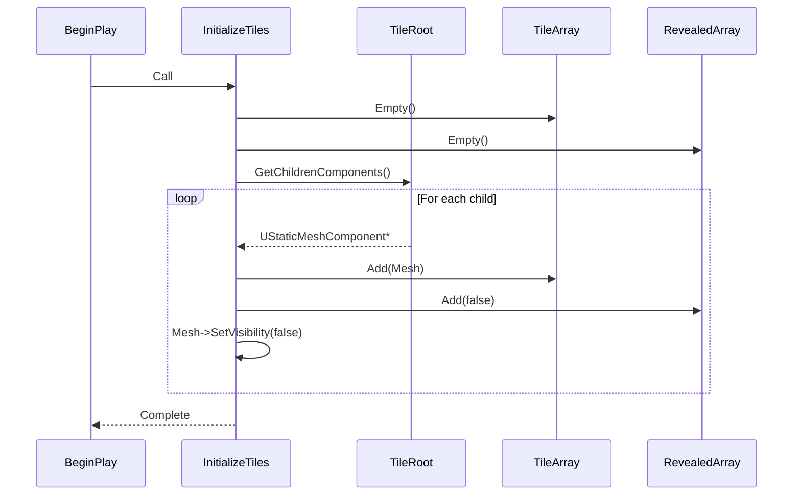

##### 타일 가시성 업데이트 알고리즘

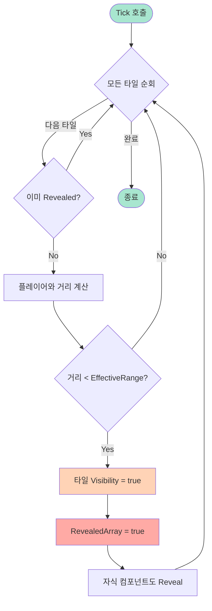

---

#### UBaseMiniMapWidget 클래스

UI 레이어에서 미니맵을 표시하고 애니메이션을 관리하는 위젯 클래스입니다.

##### 클래스 구조

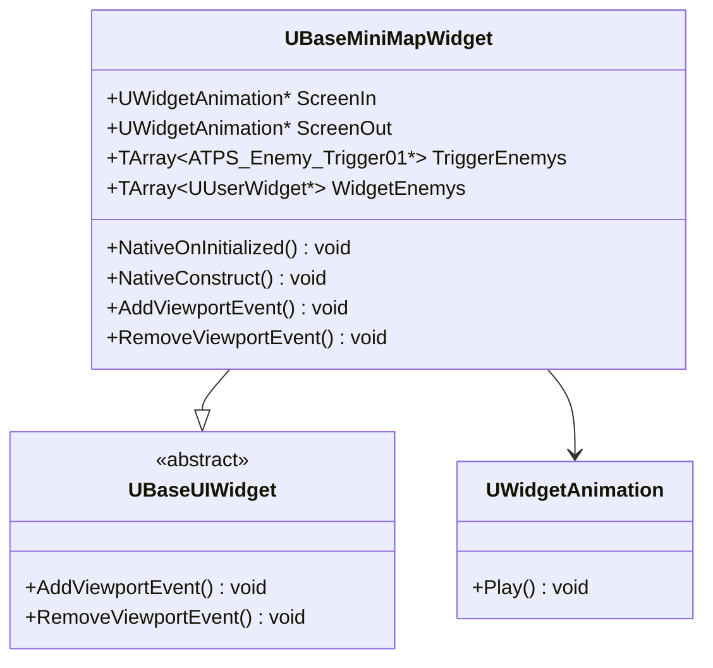

##### 헤더 파일

[BaseMiniMapWidget.h](file:///c:/Users/a0104/Desktop/git/Persona3Reroad/Public/UI/BaseMiniMapWidget.h)

```cpp
#pragma once

#include "CoreMinimal.h"
#include "UI/BaseUIWidget.h"
#include "BaseMiniMapWidget.generated.h"

class ATPS_Enemy_Trigger01;

UCLASS()
class PERSONA3REROAD_API UBaseMiniMapWidget : public UBaseUIWidget
{
    GENERATED_BODY()

public:
    UBaseMiniMapWidget(const FObjectInitializer& ObjectInitializer);
    
    virtual void NativeOnInitialized() override;
    virtual void NativeConstruct() override;
    
    virtual void AddViewportEvent() override;
    virtual void RemoveViewportEvent() override;

private:
    UPROPERTY(Transient, BlueprintReadWrite, Category="MiniMap", meta=(BindWidgetAnim, AllowPrivateAccess="true"))
    TObjectPtr<UWidgetAnimation> ScreenIn;

    UPROPERTY(Transient, BlueprintReadWrite, Category="MiniMap", meta=(BindWidgetAnim, AllowPrivateAccess="true"))
    TObjectPtr<UWidgetAnimation> ScreenOut;

    UPROPERTY(BlueprintReadWrite, Category = "Enemy", meta=(AllowPrivateAccess="true"))
    TArray<TObjectPtr<ATPS_Enemy_Trigger01>> TriggerEnemys;

    UPROPERTY(BlueprintReadWrite, Category = "Enemy", meta=(AllowPrivateAccess="true"))
    TArray<TObjectPtr<UUserWidget>> WidgetEnemys;
};
```

##### 구현 파일

[BaseMiniMapWidget.cpp](file:///c:/Users/a0104/Desktop/git/Persona3Reroad/Private/UI/BaseMiniMapWidget.cpp)

```cpp
#include "UI/BaseMiniMapWidget.h"

UBaseMiniMapWidget::UBaseMiniMapWidget(const FObjectInitializer& ObjectInitializer)
    :Super(ObjectInitializer)
{
}

void UBaseMiniMapWidget::NativeOnInitialized()
{
    Super::NativeOnInitialized();
}

void UBaseMiniMapWidget::NativeConstruct()
{
    Super::NativeConstruct();
}

void UBaseMiniMapWidget::AddViewportEvent()
{
    Super::AddViewportEvent();
    if (ScreenIn)
    {
        PlayAnimation(ScreenIn);
    }
}

void UBaseMiniMapWidget::RemoveViewportEvent()
{
    Super::RemoveViewportEvent();
    if (ScreenOut)
    {
        PlayAnimation(ScreenOut);
    }
}
```

##### 애니메이션 시스템

- **ScreenIn**: 미니맵이 화면에 나타날 때 재생 (Fade In, Scale Up 등)
- **ScreenOut**: 미니맵이 화면에서 사라질 때 재생 (Fade Out, Scale Down 등)

---

### 3.3 블루프린트 로직

Blueprint는 C++ 코어 로직 위에서 게임플레이 관련 동적 데이터를 처리합니다.

#### 주요 기능

1. **맵 스케일 조정**
   - 줌 레벨에 따른 맵 크기 조절
   - 커브를 활용한 부드러운 전환

2. **플레이어 위치 추적**
   - 실시간 플레이어 위치 반영
   - 미니맵 중심점 계산

3. **아이콘 방향 계산**
   - 플레이어 회전값을 UI 회전으로 변환
   - 포탈 및 오브젝트 아이콘 방향 설정

4. **실시간 이벤트 처리**
   - 포탈 활성화/비활성화
   - 적 트리거 감지 및 표시
   - 상호작용 오브젝트 상태 변경

#### Blueprint 노드 구조 예시

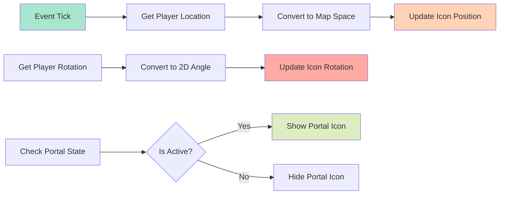

---

### 3.4 머티리얼 시스템

미니맵의 시각적 표현을 담당하는 머티리얼 시스템입니다.

#### 머티리얼 연산 구조

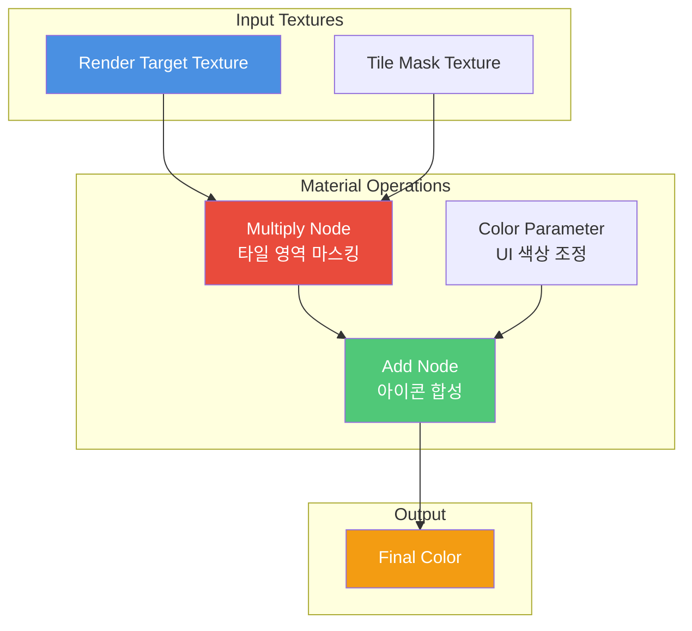

#### 주요 머티리얼 노드

| 노드 타입 | 역할 | 파라미터 |
|----------|------|---------|
| **Multiply** | Render Target과 Mask를 곱하여 탐색된 영역만 표시 | - |
| **Add** | 플레이어 아이콘, 포탈 아이콘 등을 맵 위에 합성 | - |
| **Scalar Parameter** | 맵 밝기, 투명도 조절 | `MapBrightness`, `MapOpacity` |
| **Vector Parameter** | UI 색상 변경 (탐색 영역, 미탐색 영역) | `ExploredColor`, `UnexploredColor` |

#### 파라미터화된 머티리얼

동적으로 UI 색상을 변경할 수 있도록 파라미터를 노출합니다:

```cpp
// Blueprint에서 동적 머티리얼 인스턴스 생성 및 파라미터 설정 예시
UMaterialInstanceDynamic* DynMaterial = UMaterialInstanceDynamic::Create(BaseMaterial, this);
DynMaterial->SetVectorParameterValue("ExploredColor", FLinearColor::Green);
DynMaterial->SetVectorParameterValue("UnexploredColor", FLinearColor::Gray);
DynMaterial->SetScalarParameterValue("MapOpacity", 0.8f);
```

---

### 3.5 커브 시스템

부드러운 맵 줌 인/아웃 및 전환 효과를 위한 커브 시스템입니다.

#### 커브 데이터 활용

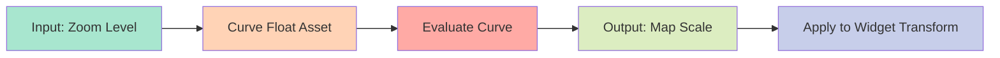

#### 구현 예시

```cpp
// Curve Float를 사용한 부드러운 줌 전환
UPROPERTY(EditAnywhere, BlueprintReadWrite, Category = "Minimap")
UCurveFloat* ZoomCurve;

float CurrentZoom = 0.5f; // 0.0 ~ 1.0
float MapScale = ZoomCurve->GetFloatValue(CurrentZoom);

// Widget Transform에 적용
FWidgetTransform Transform;
Transform.Scale = FVector2D(MapScale, MapScale);
MinimapImage->SetRenderTransform(Transform);
```

#### 커브 활용 사례

- **Zoom In/Out**: 선형이 아닌 Ease In/Out 커브로 자연스러운 전환
- **Icon Scale**: 줌 레벨에 따라 아이콘 크기 자동 조절
- **Opacity Transition**: 미니맵 표시/숨김 시 부드러운 페이드 효과

---

## 🎬 시네마틱 연출

### Sequencer를 활용한 보스 등장 컷신

Unreal Engine의 **Sequencer**를 사용하여 몰입감 있는 보스 등장 시네마틱을 제작했습니다.

#### 시네마틱 구성 요소

```mermaid
gantt
    title 보스 등장 시네마틱 타임라인
    dateFormat X
    axisFormat %S초
    
    section 카메라
    Wide Shot (환경 소개)           :0, 3
    Medium Shot (보스 등장)         :3, 6
    Close-up (보스 얼굴)            :6, 8
    Player Reaction Shot            :8, 10
    
    section 애니메이션
    보스 등장 애니메이션             :3, 7
    플레이어 경계 애니메이션          :8, 10
    
    section 사운드
    긴장감 BGM                      :0, 10
    보스 발소리 SFX                 :3, 4
    보스 포효 SFX                   :6, 7
    
    section 이펙트
    먼지 파티클                     :3, 5
    오라 이펙트                     :6, 10
```

### 주요 기술 요소

#### 1. 카메라 컷 시스템

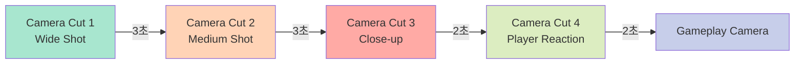

- **Camera Cut Track**: 여러 카메라 간 전환
- **Camera Shake**: 보스 등장 시 화면 흔들림 효과
- **Depth of Field**: 포커스 이동으로 시선 유도

#### 2. 애니메이션 동기화

| 트랙 | 애니메이션 | 시작 시간 | 지속 시간 |
|------|-----------|----------|----------|
| Boss | Appear_Anim | 3.0s | 4.0s |
| Boss | Roar_Anim | 6.0s | 1.0s |
| Player | Alert_Anim | 8.0s | 2.0s |

#### 3. 사운드 동기화

- **BGM Track**: 긴장감 넘치는 배경 음악 (Fade In)
- **SFX Track**: 
  - 발소리 (3.0s)
  - 포효 (6.0s)
  - 환경음 (지속)

#### 4. 이펙트 및 포스트 프로세싱

```cpp
// Sequencer에서 Post Process Volume 제어 예시
UPROPERTY(EditAnywhere, BlueprintReadWrite, Category = "Cinematic")
APostProcessVolume* CinematicPPV;

// Vignette 강도 조절 (긴장감 연출)
CinematicPPV->Settings.VignetteIntensity = 0.8f;

// Color Grading (어두운 톤)
CinematicPPV->Settings.ColorGrading.Saturation = FVector4(0.7f, 0.7f, 0.7f, 1.0f);
```

### Sequencer 워크플로우

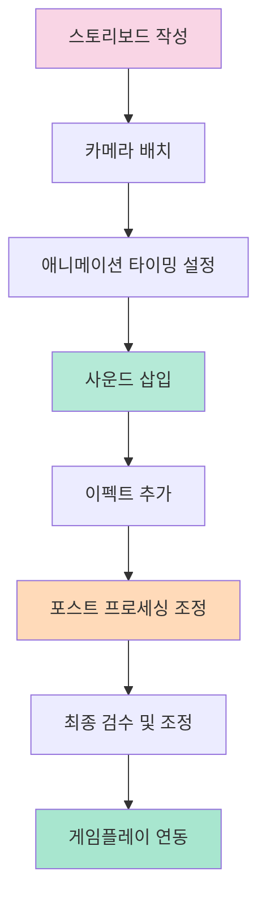

### 시네마틱 트리거 시스템

```cpp
// Blueprint에서 시네마틱 재생 트리거
UFUNCTION(BlueprintCallable, Category = "Cinematic")
void PlayBossIntroSequence()
{
    if (BossIntroSequence)
    {
        // 플레이어 입력 비활성화
        APlayerController* PC = GetWorld()->GetFirstPlayerController();
        PC->SetCinematicMode(true, false, false, true, true);
        
        // 시퀀스 재생
        ALevelSequenceActor* SequenceActor;
        FMovieSceneSequencePlaybackSettings Settings;
        ULevelSequencePlayer* Player = ULevelSequencePlayer::CreateLevelSequencePlayer(
            GetWorld(), 
            BossIntroSequence, 
            Settings, 
            SequenceActor
        );
        
        Player->Play();
        
        // 시퀀스 종료 시 게임플레이 복귀
        Player->OnFinished.AddDynamic(this, &AMyGameMode::OnCinematicFinished);
    }
}

void AMyGameMode::OnCinematicFinished()
{
    APlayerController* PC = GetWorld()->GetFirstPlayerController();
    PC->SetCinematicMode(false, false, false, true, true);
}
```

---

## 🛠️ 기술 스택

### Unreal Engine 모듈

| 모듈 | 용도 | 난이도 |
|------|------|--------|
| **Core** | 기본 프레임워크 | ⭐⭐⭐ |
| **Engine** | 게임 엔진 기능 | ⭐⭐⭐⭐ |
| **UMG** | UI 위젯 시스템 | ⭐⭐⭐ |
| **LevelSequence** | 시네마틱 시스템 | ⭐⭐⭐ |
| **RenderCore** | Render Target 처리 | ⭐⭐⭐⭐ |

### C++ 및 Blueprint 연계

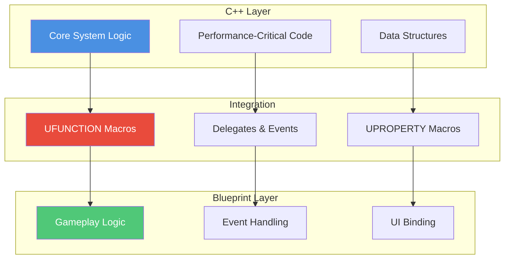

### 주요 기술 활용

#### 1. Render Target

```cpp
// Render Target 생성 및 설정
UPROPERTY(EditAnywhere, BlueprintReadWrite, Category = "Minimap")
UTextureRenderTarget2D* MinimapRenderTarget;

// Scene Capture Component 설정
CaptureComponent->TextureTarget = MinimapRenderTarget;
CaptureComponent->CaptureSource = ESceneCaptureSource::SCS_SceneColorHDR;
CaptureComponent->ProjectionType = ECameraProjectionMode::Orthographic;
CaptureComponent->OrthoWidth = 5000.0f; // 캡처 범위
```

#### 2. Material Instance Dynamic

```cpp
// 동적 머티리얼 인스턴스 생성
UMaterialInstanceDynamic* MinimapMaterial = UMaterialInstanceDynamic::Create(BaseMaterial, this);

// Render Target을 머티리얼 파라미터로 전달
MinimapMaterial->SetTextureParameterValue("MapTexture", MinimapRenderTarget);

// UI Image에 적용
MinimapImage->SetBrushFromMaterial(MinimapMaterial);
```

#### 3. Widget Animation

```cpp
// 애니메이션 재생 (C++에서 호출)
if (ScreenInAnimation)
{
    PlayAnimation(ScreenInAnimation, 0.0f, 1, EUMGSequencePlayMode::Forward, 1.0f);
}

// 애니메이션 종료 이벤트 바인딩
FWidgetAnimationDynamicEvent AnimationFinishedDelegate;
AnimationFinishedDelegate.BindDynamic(this, &UBaseMiniMapWidget::OnAnimationFinished);
BindToAnimationFinished(ScreenOutAnimation, AnimationFinishedDelegate);
```
